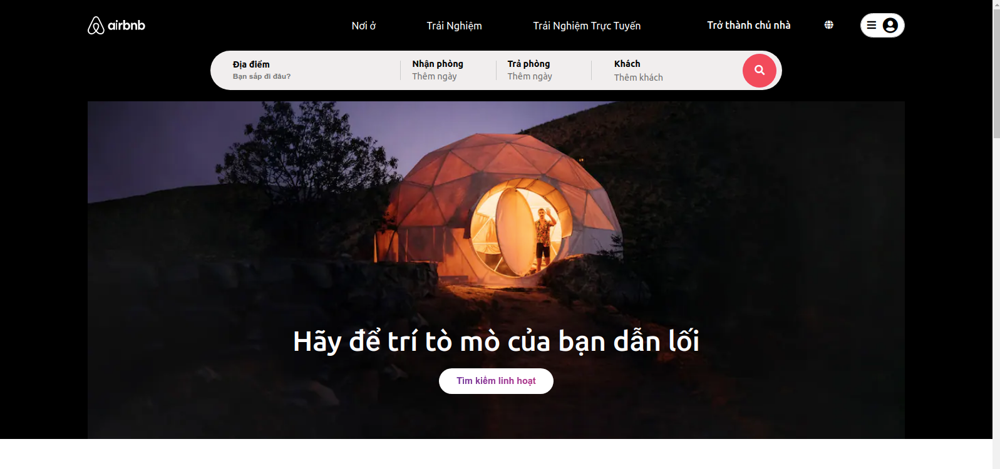
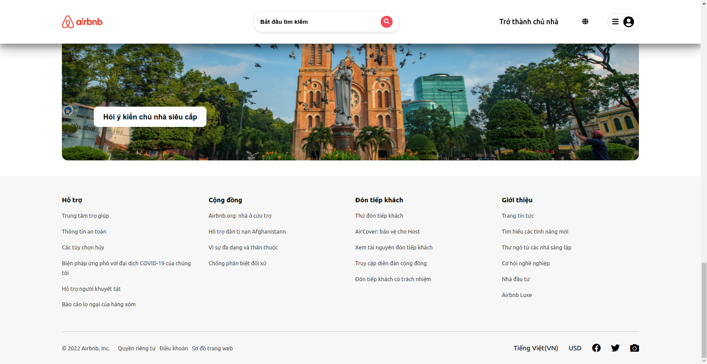
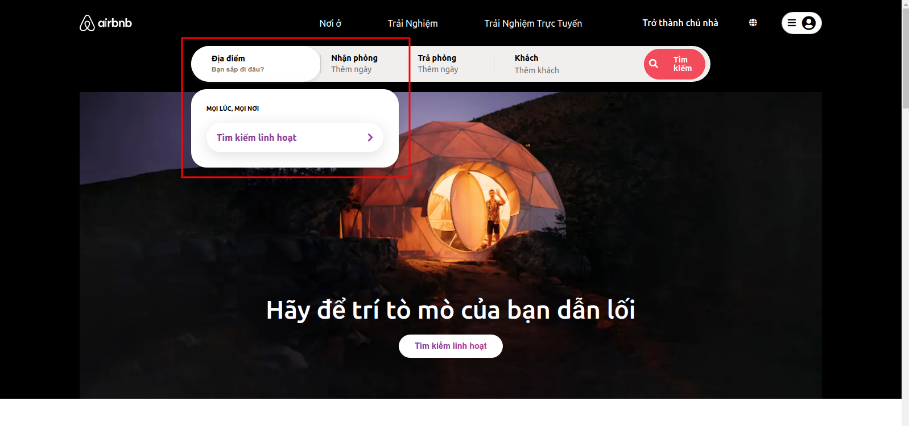
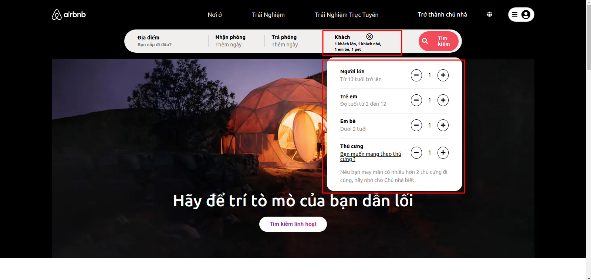
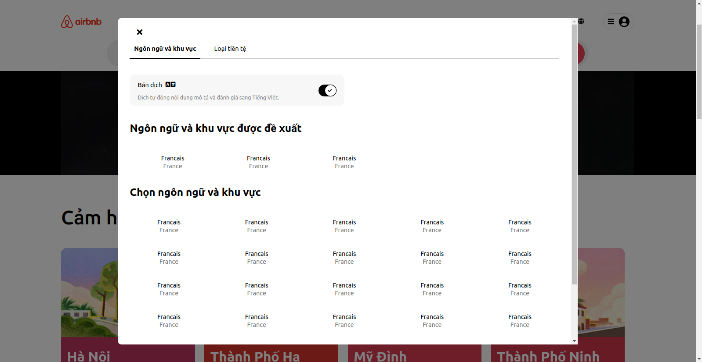

# Welcome to the AirBnB clone project!
 

## Introduction
The website that we are about to clone is [Airbnb](https://airbnb.com) website. This is a personal project for understanding how to use HTML, CSS and Javascript to build a website of your own.
The project consist of the following parts:  
1. The static frontend uses **HTML/CSS** and a web template for the objects.  
2. Making the website dynamic by using **JS** and load objects. 

### Authors
- [Khuat Huy Kien](https://github.com/kiensamson0000) | <kienkh99@gmail.com>
